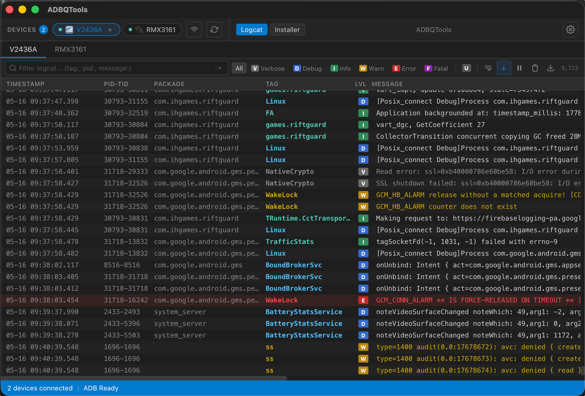
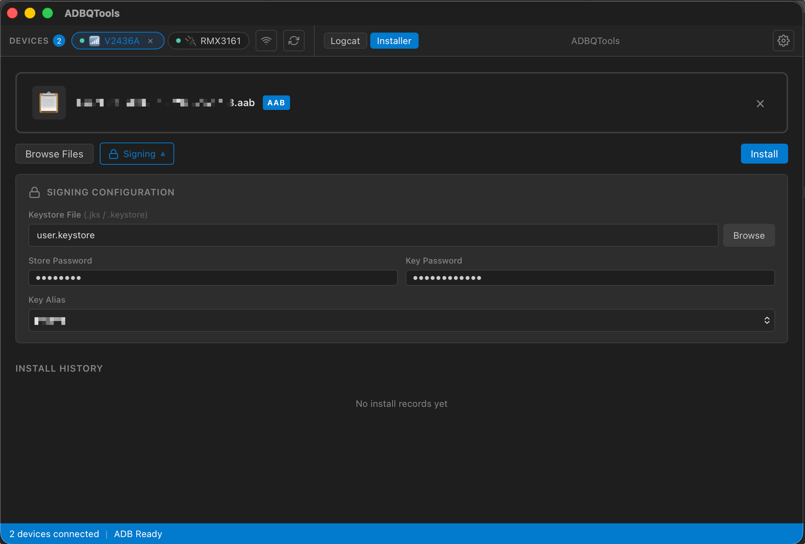

# ADBQTools

**ADBQTools** is a cross-platform desktop tool for Android developers. Built with **Tauri 2 + Rust + Svelte**, it provides real-time Logcat viewing, APK/AAB installation, and device management — all in one lightweight app.

**ADBQTools** 是一款跨平台 Android 开发者桌面工具。基于 **Tauri 2 + Rust + Svelte** 构建，集成实时 Logcat 查看、APK/AAB 安装和设备管理功能。

---

## Features / 功能

### Logcat Viewer / 日志查看器

- Real-time log streaming with virtual scrolling for high performance
- Structured query filters: `tag:`, `pid:`, `tid:`, `message:`, `level:`, `package:`
- Log level chips (V/D/I/W/E/F) with color-coded display
- **Unity mode** — filter Unity, IL2CPP, Mono logs with one click
- Regex search support
- Word wrap, auto-scroll, pause/resume, clear, export to `.txt`
- Resizable columns

---

- 高性能虚拟滚动实时日志流
- 结构化查询过滤：`tag:`, `pid:`, `tid:`, `message:`, `level:`, `package:`
- 日志级别芯片（V/D/I/W/E/F）彩色显示
- **Unity 模式** — 一键过滤 Unity、IL2CPP、Mono 日志
- 正则表达式搜索
- 自动换行、自动滚动、暂停/继续、清除、导出为 `.txt`
- 可调整列宽

### Device Management / 设备管理

- Auto-detect USB and WiFi devices
- WiFi pairing and connection (Android 11+ wireless debugging)
- Saved WiFi addresses for quick reconnection
- One-click ADB restart
- Multi-device support with tab switching

---

- 自动检测 USB 和 WiFi 设备
- WiFi 配对和连接（Android 11+ 无线调试）
- 保存 WiFi 地址快速重连
- 一键重启 ADB
- 多设备支持，标签切换

### APK/AAB Installer / 安装器

- Drag-and-drop APK/AAB installation
- AAB signing with keystore configuration (auto-detect key aliases)
- Bundletool integration for AAB → APK conversion
- Install history with status tracking

---

- 拖拽安装 APK/AAB
- AAB 签名配置（自动检测 Key 别名）
- 内置 bundletool，AAB 自动转 APK
- 安装历史记录

### Other / 其他

- Bilingual UI (English / 中文)
- Dark theme optimized for long sessions
- Embedded adb, bundletool, and JRE — no external dependencies
- Windows and macOS support

---

- 双语界面（English / 中文）
- 深色主题，适合长时间使用
- 内嵌 adb、bundletool、JRE，无需外部依赖
- 支持 Windows 和 macOS
